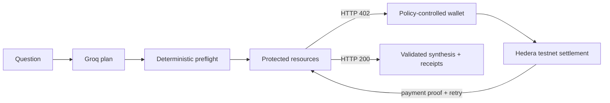

# AgriPay Agent

> Autonomous intelligence, paid one insight at a time.

AgriPay Agent is an autonomous agricultural-intelligence procurement agent built for Hedera's
x402 bounty. It plans which registered insights a question needs, evaluates each payment with
deterministic spending controls, pays on Hedera testnet, retries protected HTTP resources, and
records public receipts.

**[Live app](https://agripay-agent.vercel.app)** ·
**[Public API](https://agripay-api.duckdns.org/health)** ·
**[4-minute demo script](docs/video-script.md)** ·
**[On-chain evidence](docs/hashscan-evidence.md)** ·
**[Judge guide](docs/judging-guide.md)**

In the demo, one Nandi maize question makes Groq select three registered intelligence resources.
Each produces a real HTTP 402, an independent native-HBAR testnet settlement, and an HTTP 200
retry. The total is exactly 0.16 HBAR. Groq may choose resources, but only immutable registry data
and deterministic policy can authorize the recipient, asset, network, and amount.



### Verified three-resource evidence

| Resource            | HTTP lifecycle     |    Amount | Transaction                        | Public proof                                                                                                                                                                                                              | Status    |
| ------------------- | ------------------ | --------: | ---------------------------------- | ------------------------------------------------------------------------------------------------------------------------------------------------------------------------------------------------------------------------- | --------- |
| Disease risk        | 402 → settle → 200 | 0.07 HBAR | `0.0.9676583-1784671641-501210796` | [HashScan](https://hashscan.io/testnet/transaction/1784671641.501210796?tid=0.0.9676583-1784671641-501210796) · [Mirror node](https://testnet.mirrornode.hedera.com/api/v1/transactions/0.0.9676583-1784671641-501210796) | Delivered |
| Weather risk        | 402 → settle → 200 | 0.05 HBAR | `0.0.9676583-1784671645-343987679` | [HashScan](https://hashscan.io/testnet/transaction/1784671645.343987679?tid=0.0.9676583-1784671645-343987679) · [Mirror node](https://testnet.mirrornode.hedera.com/api/v1/transactions/0.0.9676583-1784671645-343987679) | Delivered |
| Market intelligence | 402 → settle → 200 | 0.04 HBAR | `0.0.9676583-1784671645-928120887` | [HashScan](https://hashscan.io/testnet/transaction/1784671645.928120887?tid=0.0.9676583-1784671645-928120887) · [Mirror node](https://testnet.mirrornode.hedera.com/api/v1/transactions/0.0.9676583-1784671645-928120887) | Delivered |

The agricultural providers currently return curated demonstration fixtures—not live agronomic
advice. The payment, policy, persistence, and public-ledger paths are genuine.

## Why x402 and Hedera

x402 makes per-request payment part of ordinary HTTP: request, 402 requirements, signed
payment, settlement, and retry. Hedera provides a native HBAR rail with predictable fees and
public testnet evidence. This implementation is pinned to Hedera's alpha x402 v1 fork; it does
not silently mix current v2 headers into the flow.

## Spending controls

Only registered resources, exact configured prices, allowed sellers, HBAR, and Hedera testnet
are accepted. Per-resource, per-task, and periodic budgets use integer tinybars. Expiry,
idempotency, changed requirements, duplicates, and replay attempts are rejected before signing.

## Repository

- `packages/schemas`: trusted boundary schemas
- `packages/config`: secret-safe startup validation
- `packages/fixtures`: registered resources and demonstration data
- `packages/policy`: deterministic payment authorization
- `packages/payments`: strict Hedera exact-payment and provisioning code
- `packages/storage`: SQLite migrations, task state, replay protection, backup and restore
- `packages/planner`: strict Groq planner, safe discovery, synthesis, and deterministic fallback
- `packages/agent`: durable multi-resource orchestration and sanitized receipts
- `apps/agent-api`: bounded task, timeline, receipt, policy, catalogue, and health APIs
- `apps/web`: React/Vite frontend, component tests, and deterministic Playwright coverage
- `apps/resource-server`: three protected fixture resources
- `apps/facilitator`: verification, replay protection, and settlement
- `docs/adr`: compatibility and architecture decisions

See [local development](docs/local-development.md) and the [architecture](docs/architecture.md).
Public testnet proof is recorded in [HashScan evidence](docs/hashscan-evidence.md).

## Production

The production frontend is <https://agripay-agent.vercel.app> and the API is <https://agripay-api.duckdns.org>. The backend runs in bounded mock mode with live Hedera payments disabled by default. The API, protected resource server, and facilitator run as separate non-root systemd services bound to loopback. See the [Contabo runbook](docs/deployment/contabo.md), [Vercel runbook](docs/deployment/vercel.md), and [rollback procedure](docs/deployment/rollback.md).

For a 60-second, non-spending verification:

```bash
corepack enable
pnpm install --frozen-lockfile
pnpm demo:preflight
```

## Frontend routes

- `/` — product narrative, catalogue, lifecycle and verified evidence
- `/agent` — question composer, exact preflight, task timeline and payment controls
- `/receipts` — bounded public receipt search and detail inspection
- `/developer` — human and sanitized-JSON x402 inspection
- `/about` — architecture, policy boundary, recovery and roadmap

## Disclosure

Agricultural outputs use curated demonstration data. They are not live meteorological,
agronomic, disease-surveillance, financial, or market advice.

## License and attribution

Apache-2.0. The planned Hedera integration targets `hedera-dev/x402-hedera` commit
`d11dc65ab12fbdf644f1b2dba40fdd05f5a9ab1`, also Apache-2.0. See the ADR before modifying
protocol dependencies.
