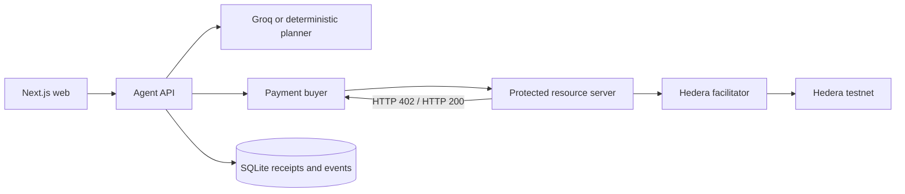

# Architecture

Groq may select only registered resource IDs and provide rationale. It cannot supply URLs, recipients, prices, payment
status, or policy values. The deterministic policy package is independent of the planner and
uses integer tinybars throughout.

All fixture intelligence is curated demonstration data and is not meteorological, agronomic,
disease-surveillance, financial, or market advice.

## Phase 1 account roles

The bootstrap operator funds three distinct ECDSA testnet roles. The buyer signs the HBAR debit,
the seller receives the exact resource price, and the facilitator adds its fee-payer signature,
submits the transaction, and waits for the Hedera receipt. Browser code holds no key material.

The pinned alpha verifier is wrapped with exact transfer and signature introspection described
in [ADR 0002](adr/0002-hedera-exact-verification.md).

## Phase 2 task flow

The orchestrator persists `created → planning → plan_ready → preflight_policy_check`, then
processes resources sequentially through 402, policy, signing, verification, settlement, retry,
validation, and delivery. Sequential processing is intentional: it makes spend and recovery
inspectable. Synthesis receives only the sanitized question and schema-validated delivered
fixtures. Missing resources produce a partial answer and are never invented.

SQLite uses WAL, full synchronous writes, foreign keys, `BEGIN IMMEDIATE` claims, and unique
constraints for task/resource, submission key, idempotency key, requirement/payment digest,
nonce, and transaction ID. An ambiguous transaction is queried through the testnet mirror node
before its state can advance; it is never blindly paid again.
