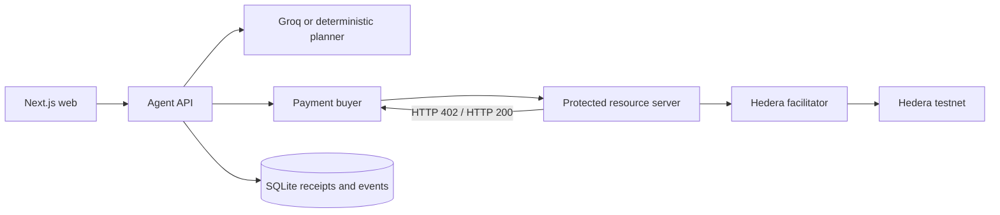

# Architecture

AI may select only registered resources. It cannot supply URLs, recipients, prices, payment
status, or policy values. The deterministic policy package is independent of the planner and
uses integer tinybars throughout.

All fixture intelligence is curated demonstration data and is not meteorological, agronomic,
disease-surveillance, financial, or market advice.

## Phase 1 account roles

The bootstrap operator funds three distinct ECDSA testnet roles. The buyer signs the HBAR debit,
the seller receives the exact resource price, and the facilitator adds its fee-payer signature,
submits the transaction, and waits for the Hedera receipt. Browser code holds no key material.

The pinned alpha verifier is wrapped with exact transfer and signature introspection described
in [ADR 0002](adr/0002-hedera-exact-verification.md).
