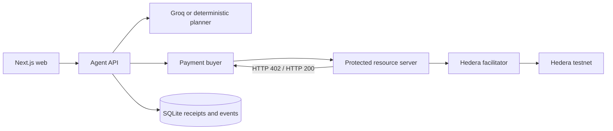

# Architecture

AI may select only registered resources. It cannot supply URLs, recipients, prices, payment
status, or policy values. The deterministic policy package is independent of the planner and
uses integer tinybars throughout.

All fixture intelligence is curated demonstration data and is not meteorological, agronomic,
disease-surveillance, financial, or market advice.
